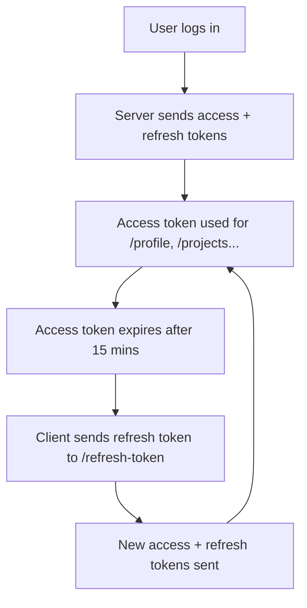

# 🔐 **JWT Authentication System – Access Token & Refresh Token**

## 🧠 **What Are These Tokens?**

### ✅ Access Token

- A **short-lived** token (e.g., 15 minutes).
- Used to authenticate **each API request** (like `/profile`, `/projects`, etc).
- Stored in **httpOnly cookies** for security.
- Automatically attached to requests by the browser (when `withCredentials: true` is set on frontend).

### 🔁 Refresh Token

- A **long-lived** token (e.g., 7 days).
- Used **only to request a new access token** once the old one expires.
- Stored in secure `httpOnly` cookies.
- Sent only to one endpoint: `/api/v1/users/refresh-token`.

---

## 🔒 **Why Two Tokens?**

| Token Type    | Lifetime    | Purpose                        | Risk                         |
| ------------- | ----------- | ------------------------------ | ---------------------------- |
| Access Token  | Short (15m) | Auth for protected APIs        | Safer if compromised         |
| Refresh Token | Long (7d)   | Re-issue access token silently | Higher risk, but limited use |

---

## ⚙️ **Token Lifecycle Flow**



---

## 🛠️ **Key Endpoints**

| Endpoint         | Purpose                                              | Method |
| ---------------- | ---------------------------------------------------- | ------ |
| `/login`         | Logs in user & sends tokens                          | POST   |
| `/profile`       | Protected route needing access token                 | GET    |
| `/refresh-token` | Generates a new access token using the refresh token | POST   |
| `/logout`        | Clears cookies, invalidates refresh token            | POST   |

---

## 🔍 **Access Token Expired — What Happens?**

- Access token is validated in `verifyJWT` middleware.
- If expired:

  - You receive a **401 Unauthorized** response.
  - You **do not need to re-login** if the refresh token is still valid.
  - Instead, **call `/refresh-token`** to get new access and refresh tokens.

---

## 🔁 **How to Refresh Tokens**

- Automatically on frontend (Axios example):

```js
axios.interceptors.response.use(
  (res) => res,
  async (error) => {
    if (error.response?.status === 401) {
      await axios.post(
        "/api/v1/users/refresh-token",
        {},
        { withCredentials: true }
      );
      return axios(error.config); // retry original request
    }
    return Promise.reject(error);
  }
);
```

---

## ⚠️ **When Refresh Token Also Expires**

- You’ll get **401 Unauthorized** from `/refresh-token`.
- In that case:

  - Redirect to login page.
  - Clear cookies.

---

## 🔐 **Backend Implementation Overview**

### 1. Generate Tokens (in controller)

```js
user.generateAccessToken(); // 15m expiry
user.generateRefreshToken(); // 7d expiry
```

### 2. `verifyJWT` Middleware

- Verifies access token on protected routes.
- Throws 401 on expiration.

### 3. `refreshAccessToken` Handler

- Verifies refresh token.
- Issues new tokens if valid.

---

## 🔧 Environment Variables

```env
ACCESS_TOKEN_SECRET=your-secret-key
ACCESS_TOKEN_EXPIRY=15m

REFRESH_TOKEN_SECRET=your-refresh-secret
REFRESH_TOKEN_EXPIRY=7d
```

---

## ✅ Best Practices

- Store both tokens in `httpOnly` cookies.
- Never expose them to JavaScript (`httpOnly`, `secure`, `sameSite=Strict`).
- Refresh access tokens only when a 401 is received.
- Re-authenticate if both tokens expire.

---

## 📌 Summary Checklist

| ✅  | Step                                     |
| --- | ---------------------------------------- |
| ✔️  | Login → Set access + refresh tokens      |
| ✔️  | Use access token on each protected route |
| ✔️  | On 401, call `/refresh-token`            |
| ✔️  | If refresh fails → log out user          |
| ✔️  | All token logic secured via middleware   |

---
